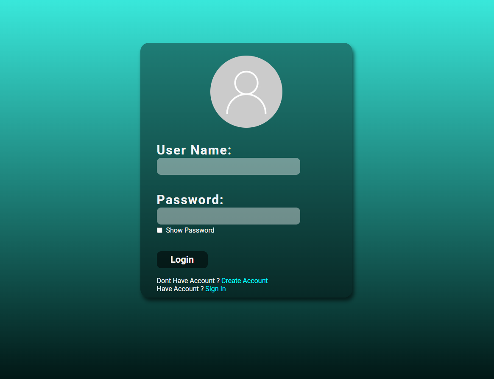

# **Login Page with User Authentication (PHP, MySQL, JS)**

A simple login and registration system built using **PHP**, **MySQL**, and **JavaScript**. Features user authentication, password validation, and a responsive design.

### **Features**
- **Login & Registration**: Create and log in with username and password.
- **Password Hashing**: Secure password storage and validation.
- **Client-Side Validation**: Check for spaces in usernames and passwords.
- **Password Visibility Toggle**: Show/hide password in forms.



### **Technologies**
- **Frontend**: HTML, CSS, JavaScript
- **Backend**: PHP, MySQL
- **Security**: Password hashing in PHP

### **Setup**
1. Clone the repository:
   ```bash
   git clone https://github.com/SMutaf/Login_Screen.git
